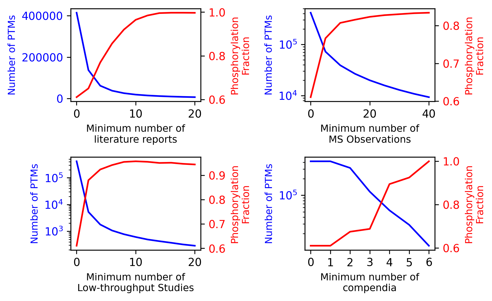
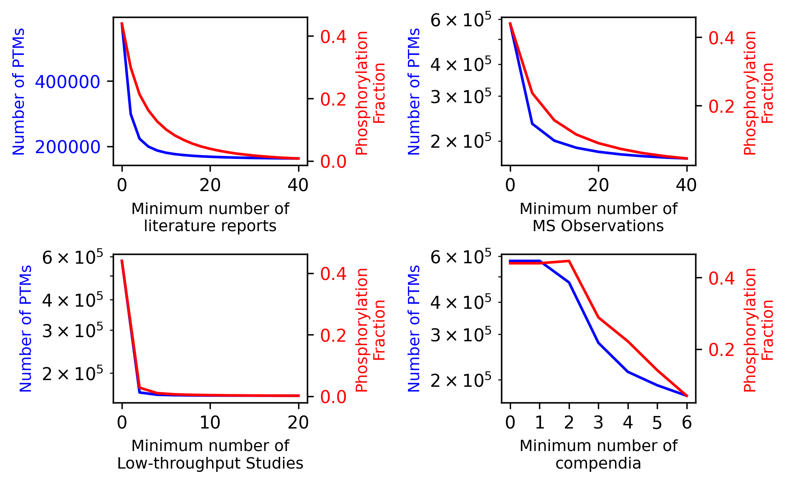
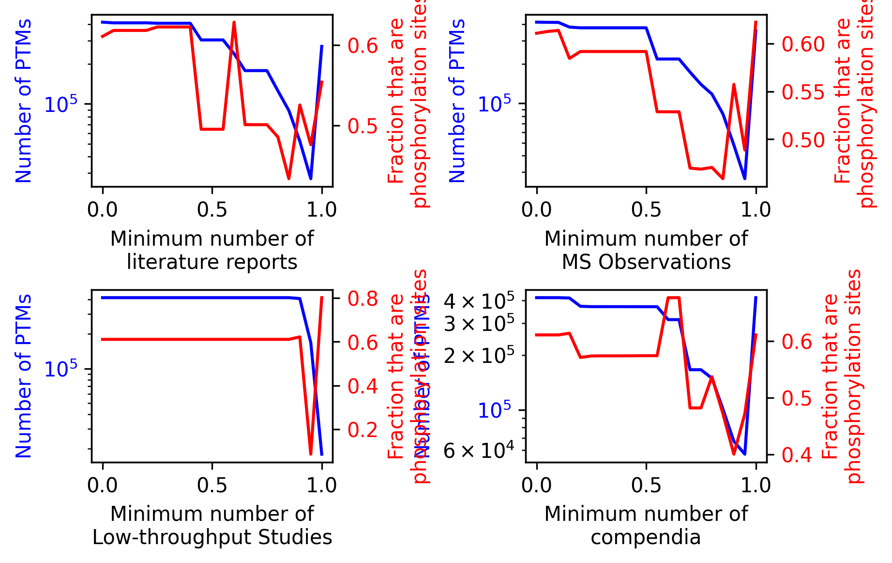

Filtering PTMs and Events
=========================

PTM-POSE offers various ways that you can filter PTMs and events to focus on the most relevant data for your analysis. You can choose to filter PTMs during the projection step (when PTMs impacted by splice events are first identified) or after the projection step to refine your datase further. All projection and downstream analysis functions in PTM-POSE include optional filtering parameters that allow you to restrict data based on specific criteria.

Types of Available Filters
--------------------------

PTM Filters:

1. **By PTM Type (`modification_class = None`)**: Filter PTMs based on their type, such as phosphorylation, acetylation, glycosylation.
2. **By Number of Literature Reports (`num_studies = 0`)**: Filter PTMs based on how many literature publications report the PTM (either by mass spec or low throughput studies) 
3. **By Number of Mass Spec Observations (`num_MS_observations = 0)**: Filter events based on how many mass spec experiments (either in literature or by PhosphoSitePlus)
4. **By Number of Low-Throughput Studies (`num_LTP_studies = 0`)**: Filter PTMs based on how many low-throughput studies report the PTM, based on ddata from PhosphoSitePlus
5. **By Number of Compendia/Databases (`min_compendia = 0`)**: Filter PTMs based on how many compendia (mass spec databases) report the PTM
2. **By Constitutive Status (`remove_novel = True`)**: Filter PTMs based on whether they have been previously observed to be variable across isoforms or are novel (based on data from Ensembl)

Event Filters:

1. **By Event Significance (`alpha = 0.05`)**: Filter events based on their significance from splicing analysis tools.
2. **By Event dPSI (`min_dpsi = 0.1`)**: Filter events based on their deltaPSI values, focusing on the most significant changes 

Note: By default, the majority of downstream analysis modules restrict data to significant events with a deltaPSI of 10% or greater (if significance and/or deltaPSI values are available). However, you can adjust these parameters to suit your specific research needs.

How to Filter PTMs and Events
-----------------------------

Filtering PTMs during Projection
~~~~~~~~~~~~~~~~~~~~~~~~~~~~~~~~

To filter PTMs prior to projecting them onto your splice events or isoforms, all you need to do is add the desired filtering parameters to the projection function being used (`project_ptms_onto_splice_events`, `project_ptms_onto_MATS`, `project_ptms_onto_SpliceSeq`). For example, to only use PTMs with at least 2 literature reports and that have been observed to be different across isoforms before, you would use the following code:

.. code-block:: python

    from ptm_pose import project

        from ptm-pose import project

    my_splice_data_annotated, spliced_ptms = project.project_ptms_onto_splice_events(my_splice_data, 
            chromosome_col = 'chromosome',
            strand_col = 'strand',
            region_start_col = 'region start',
            region_end_col =  'region end',
            event_id_col = 'event id',
            gene_col = 'Gene name',
            dPSI_col='dPSI',
            coordinate_type = 'hg19',
            num_studies = 2, remove_novel = True) ### These are the filtering parameters

Filtering PTMs during analysis
~~~~~~~~~~~~~~~~~~~~~~~~~~~~~~

Alternatively, you may choose to project PTMs without filtering and then filter the data during analysis. As with projection, the majority of the modules in PTM-POSE include optional filtering parameters that allow you to restrict data based on specific criteria. For example, to filter PTMs and look at how many PTMs were identified with at least 2 literature reports and that have been observed to be different across isoforms before, you would use the following code:

.. code-block:: python

    from ptm_pose.analyze import summarize

    filtered_spliced_ptms = summarize.plot_modification_breakdown(spliced_ptms,
                                                                    num_studies = 2, remove_novel = True) ### These are the filtering parameters

Why Filter?
-----------

Filtering PTMs and events can help you focus on the most relevant data for your analysis, focusing on those that are most likely to be 1) measurable and 2) biologically relevant. For example, some PTMs recorded in databases may only be the result of a single mass spec experiment, which may or may not be reproducible and an indication of a true PTM site. Similarly, splicing quantification tools may produce events that are unlikely to be biologically relevant due to small overall changes in inclusion or general noise in the data (leading to false positive splice events). By filtering your data, you focus on higher confidence PTM sites.

However, we generally recommend filtering PTMs conservatively, as filtering too aggressively can lead to the loss of potentially interesting data and trends across your data, as well as skew the data towards phosphorylation sites, which are generally more well studied than other PTM types. See next section for an example of this. As such, we recommend filtering primarily when you have a specific research question in mind or when you are looking for good candidates for further experimental validation.

Impact of Filtering PTMs by evidence
------------------------------------

As an example of what happens when filter too aggressively, consider the impact of filtering PTMs based on the number of studies that have reported the PTM or the number of databases:

Here, even with small filters, you quickly reduce the number of available PTMs and significantly increase the fraction of PTMs that are phosphorylation sites (i.e. non-phosphorylation sites are dropped)

To avoid phosphorylation site skew, we provide two alternative filtering approaches. First, by setting `phospho_only_evidence_filter = True`, you can filter only phosphorylation sites based on the number of studies/databases, while keeping other PTM types regardless of evidence. The result is below:

Second, by using quantile filtering, you can filter PTMs based on the top X% of studies/databases for that PTM type, accounting for the fact that phosphorylation sites are generally more well-studied than other PTM types:

Ultimately, it is up to your discretion about the best way to filter your data for your specific research question. If you are unsure, we recommend exploring the impact of different filter parameters using the `analyze.filter` module to see how your data changes based on different filtering criteria. See analysis gallery for examples of how to use the filtering functions in PTM-POSE.

